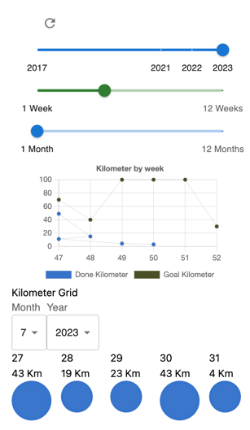

# Strava Metrics Dashboard

## Overview
This project is a frontend application that allows users to view their Strava data in a more customisable and meaningful
way.

_**Disclaimer:** This project is still in development and aims to progress my personal running journey._

## Features
- **Goal-Oriented Comparison:** Visualize your running achievements against your set goals in multiple engaging ways.
- **Versatile Viewing Modes:** Explore various modes to track and analyze your progress effectively.

## User Interface

### Dive into these Viewing Modes:

- **Line Chart** Monitor your activity trends across years, months, or the last 12 dynamic weeks.
- **Bubbles** Witness your calendar weeks represented as bubbles, each scaling to reflect your accomplished kilometers.